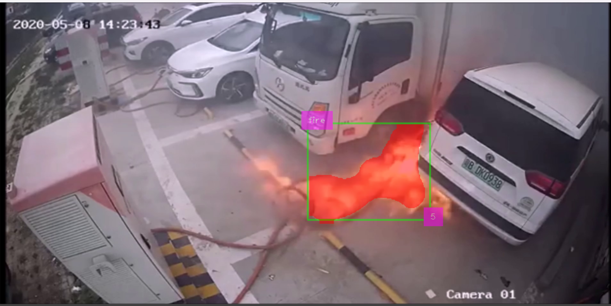
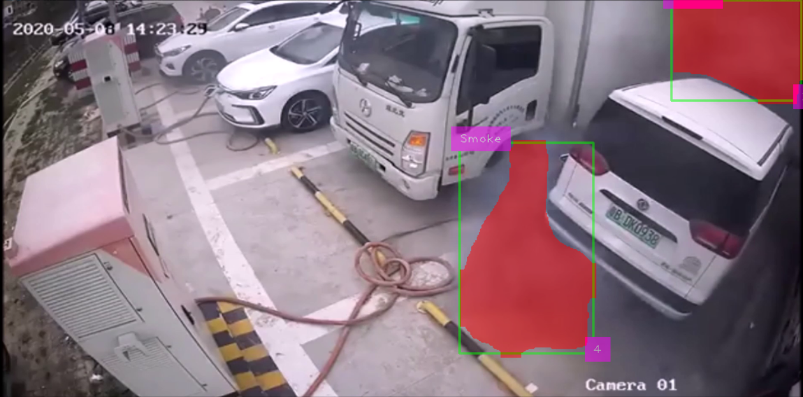

## Introduction

**FireAlertAI** is an intelligent system designed to detect fire and smoke in real-time using advanced computer vision and AI techniques. It aims to enhance safety by providing timely alerts via email when fire or smoke is detected, helping prevent potential disasters.

## Features

- Real-time fire and smoke detection using YOLO-based object detection.
- Visual overlays for bounding boxes and segmentation masks.
- Email alerts with image attachments for detected incidents.
- Configurable email cooldown period to prevent spam.
- Easy integration with video streams or webcam feeds.
- Multi-threaded email sending for optimal performance.

## Installation

### Prerequisites

- Python 3.8 or later
- Pip (Python package manager)
- A pre-trained YOLOv11 model (`best.pt`) for fire and smoke detection
- OpenCV and other required Python libraries

### Steps

1. Clone the repository:
   ```bash
   git clone https://github.com/AmmarMohamed0/FireAlertAI.git
   cd FireAlertAI
   ```

2. Install the required Python packages:
   ```bash
   pip install -r requirements.txt
   ```

3. Download the YOLO model weights (`best.pt`) and place them in the project directory.

4. Update the email credentials in the `send_email` function:
   ```python
   server.login("your_email@gmail.com", "Your Password")
   ```

   > Use [Google App Passwords](https://myaccount.google.com/apppasswords) to create a temporary password.

5. Run the script:
   ```bash
   python fire_alert_ai.py
   ```

## Usage

### Example

1. Replace `sample.mp4` with the path to your video file or webcam index in the following line:
   ```python
   video_capture = cv2.VideoCapture('sample.mp4')
   ```

2. Run the script to start detection. Detected fire or smoke will trigger an email alert:
   ```bash
   python fire_alert_ai.py
   ```

### Code Snippets

**Send Email Alert:**
```python
send_email("receiver_email@example.com", frame)
```

**Process Detected Objects:**
```python
for box, track_id, class_id, mask in zip(bounding_boxes, tracking_ids, detected_class_ids, segmentation_masks):
    # Process detection logic
```

## Screenshots

| Fire Detected              | Smoke Detected             |
|----------------------------|----------------------------|
|    |  |

## Technologies

- **Programming Language:** Python
- **Frameworks and Libraries:**
  - OpenCV
  - cvzone
  - ultralytics (YOLO)
  - NumPy
  - smtplib
  - threading

